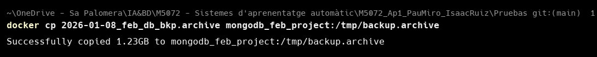
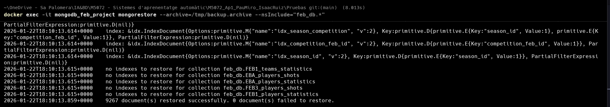
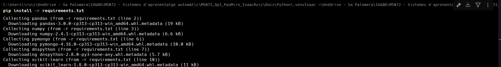

# 📊 Part 1: ETL i Model de Dades

## Introducció i Objectius
En aquesta fase inicial, l'objectiu és transformar les dades "crues" de MongoDB en un dataset estructurat i net, preparat per a l'aprenentatge automàtic. Hem realitzat un procés ETL (Extract, Transform, Load) complet.

## 0. Creació entorn Docker
Per a crear l'entorn Docker, s'ha utilitzat el fitxer `docker-compose.yaml` on s'ha configurat un container de MongoDB. Un cop tenim el container de MongoDB en funcionament, podem connectar-nos a la base de dades i començar a treballar amb les dades.

## 1. Restaurar dades MongoDB
Copiarem el fitxer de backup de MongoDB que hem fet anteriorment i el guardarem en el directori `tmp` del container de MongoDB.

Un cop tenim el fitxer de backup en el directori `tmp`, podem restaurar les dades a la base de dades.

## 2. Connectivitat MongoDB amb Python
Abans de connectar-nos a la base de dades, hem de instal·lar les llibreries necessàries. Per fer-ho tot més senzill, hem utilitzat el fitxer `requirements.txt` amb les llibreries que utilitzarem durant el procés.

