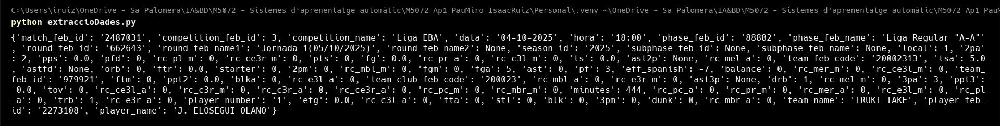

# 📊 Part 1: ETL i Model de Dades

## Introducció i Objectius
En aquesta fase inicial, l'objectiu és transformar les dades "crues" de MongoDB en un dataset estructurat i net, preparat per a l'aprenentatge automàtic. Hem realitzat un procés ETL (Extract, Transform, Load) complet.

## 0. Creació entorn Docker
Per a crear l'entorn Docker, s'ha utilitzat el fitxer `docker-compose.yaml` on s'ha configurat un container de MongoDB. Un cop tenim el container de MongoDB en funcionament, podem connectar-nos a la base de dades i començar a treballar amb les dades.

## 1. Restaurar dades MongoDB
Copiarem el fitxer de backup de MongoDB que hem fet anteriorment i el guardarem en el directori `tmp` del container de MongoDB.


Un cop tenim el fitxer de backup en el directori `tmp`, podem restaurar les dades a la base de dades.


## 2. Connectivitat MongoDB amb Python
Abans de connectar-nos a la base de dades, hem de instal·lar les llibreries necessàries. Per fer-ho tot més senzill, hem utilitzat el fitxer `requirements.txt` amb les llibreries que utilitzarem durant el procés.


Un cop instal·lades les llibreries, podem connectar-nos a la base de dades i començar a treballar amb les dades. Per realitzar això hem utilitzat el fitxer `connMongo.py` on hem creat una funció que retorna la connexió a la base de dades. Un cop tenim aquest fitxer farem una petita prova de connexió al mongoDB.



Com veiem hem mostrat un resultat de FEB3_players_statistics i podem veure que la connexió ha estat correcta.

## 3. Definició de l'Arquitectura de Dades

Per tal d'estructurar el flux de dades de manera professional i escalable, hem decidit implementar una **Arquitectura Medallion (Multi-hop Architecture)** utilitzant **Azure Blob Storage** com a Data Lake.

Aquesta arquitectura organitza les dades en tres capes lògiques de qualitat progressiva:

### 3.1. Per què Azure Blob Storage?
Hem decidit externalitzar l'emmagatzematge al núvol (Cloud) per diversos motius tècnics:

* **Simulació d'entorn Big Data real:** En la indústria, les dades no es guarden en local, sinó en Data Lakes distribuïts.
* **Desacoblament (Decoupling):** Separem la *computació* (el nostre script Python local) de l'*emmagatzematge* (Azure). Això permet que tant l'Isaac com el Pau puguin accedir a les mateixes dades processades sense haver d'enviar-se fitxers CSV manualment.
* **Traçabilitat:** Podem mantenir l'històric de les dades originals encara que ens equivoquem en el processament posterior.

### 3.2. Estructura de Capes (The Medallion Architecture)

El nostre pipeline ETL mou les dades a través de tres contenidors al núvol:

#### 🥉 Capa BRONZE (Raw Zone)
* **Descripció:** És la "zona d'aterratge". Conté una còpia exacta de les dades tal com s'han extret de MongoDB, sense cap modificació.
* **Format:** Fitxer `.csv` amb totes les columnes originals.
* **Funció:** Actua com a còpia de seguretat immutable. Si cometem un error en la neteja, sempre podem tornar a aquesta capa per regenerar el dataset sense haver de tornar a consultar la base de dades.
* **Contingut:** Totes les temporades i competicions (FEB3/EBA) amb registres "bruts" (inclosos jugadors amb 0 minuts, noms duplicats o dades errònies).

#### 🥈 Capa SILVER (Clean Zone)
* **Descripció:** Dades netes, filtrades i tipificades.
* **Transformacions aplicades:**
    * **Filtratge de qualitat:** Eliminació de jugadors amb menys de X minuts o partits jugats (per evitar distorsions estadístiques per *small sample size*).
    * **Neteja d'estructures:** Eliminació de columnes innecessàries (IDs interns de Mongo) i estandardització de noms d'equips i temporades.
    * **Gestió de Nuls:** Imputació de valors `0` on hi ha `NaN` en estadístiques de comptatge.
* **Contingut:** Una taula estructurada on cada fila és un jugador/temporada vàlid per a l'anàlisi.

#### 🥇 Capa GOLD (Business / ML Zone)
* **Descripció:** Dades enriquides i llestes per alimentar el model de Machine Learning.
* **Feature Engineering:** En aquesta capa és on apliquem el coneixement de domini (bàsquet) per crear noves mètriques que no existien a l'origen:
    * **OER (Offensive Efficiency Rating):** Punts per possessió.
    * **Possessions Estimades:** Fórmula avançada per calcular el volum de joc real.
    * **% Volum de Tirs:** Distribució de tirs (Triples vs Tirs de 2).
* **Contingut final:** Aquest és el dataset (`final_dataset.csv`) que llegirà l'algorisme **K-Means** a la Part 2 del projecte.

### 3.3. Esquema del Pipeline

```mermaid
graph LR
    A[("MongoDB (Origen)")] -->|Extract| B(Python Script)
    B -->|Load Raw| C[("Azure Blob: BRONZE")]
    C -->|Clean & Filter| D[("Azure Blob: SILVER")]
    D -->|Feature Engineering| E[("Azure Blob: GOLD")]
    E -->|Input| F{Model K-Means}
    
    style C fill:#cd7f32,stroke:#333,stroke-width:2px,color:white
    style D fill:#c0c0c0,stroke:#333,stroke-width:2px,color:black
    style E fill:#ffd700,stroke:#333,stroke-width:2px,color:black


