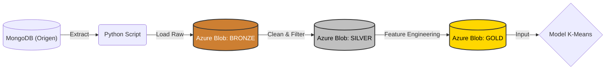

# Part 1: ETL i Model de Dades

## Introducció i Objectius
En aquesta fase inicial, l'objectiu és transformar les dades "crues" de MongoDB en un dataset estructurat i net, preparat per a l'aprenentatge automàtic. Hem realitzat un procés ETL (Extract, Transform, Load) complet, integrant tecnologies de contenidorització i emmagatzematge al núvol.

## 0. Desplegament de la Infraestructura (Docker)
Per garantir la reproductibilitat de l'entorn i l'aïllament del servei de base de dades, hem implementat una arquitectura contenidoritzada utilitzant **Docker Compose**.

S'ha configurat el servei `mongodb` al fitxer [docker-compose.yaml](../Docker/docker-compose.yaml), definint:
* **Imatge:** `mongo:latest` per disposar de l'última versió estable.
* **Persistència:** Configuració de **Volums** (`mongo_data`) per assegurar que les dades sobrevisquin al reinici del contenidor.
* **Mapeig de Ports:** Exposició del port `27017` per permetre la connexió des del nostre entorn de desenvolupament local (Python).

## 1. Ingesta i Restauració de Dades
El procés de càrrega inicial de dades (Data Seeding) s'ha realitzat a partir d'un arxiu binari `.archive`. Aquest procés consta de dues fases crítiques:

**Fase A: Transferència al Contenidor**
Mitjançant la comanda `docker cp`, hem transferit l'arxiu de còpia de seguretat des del sistema host fins al directori temporal (`/tmp`) dins del contenidor en execució.

**Fase B: Execució del Mongorestore**
Un cop l'arxiu és accessible pel contenidor, hem executat la utilitat `mongorestore` per reconstruir les col·leccions (`FEB3_players_statistics`, `FEB3_players_shots`, etc.) dins la nostra instància local.

## 2. Configuració de l'Entorn de Desenvolupament
Per interactuar programàticament amb la base de dades, hem establert un entorn de desenvolupament en Python basat en la gestió estricta de dependències i la modularitat del codi.

**Gestió de Dependències**
S'ha utilitzat un fitxer [requirements.txt](../Python/requirements.txt) per definir i instal·lar les llibreries necessàries (`pymongo`, `pandas`, `azure-storage-blob`, `python-dotenv`), assegurant que tots els membres de l'equip treballin amb les mateixes versions.

**Mòdul de Connexió (Modularització)**
Per evitar la duplicació de codi i millorar la seguretat, hem encapsulat la lògica de connexió en el mòdul [Codi Font: connMongo.py](../Python/Part1/connMongo.py). Aquest script implementa el patró **Singleton** per gestionar la connexió i carrega dinàmicament les variables d'entorn (IP, Port) segons si s'executa en local o via VPN (Tailscale).

A continuació, es mostra la validació de la connexió recuperant els primers registres de la col·lecció d'estadístiques:

## 3. Definició de l'Arquitectura de Dades

Per tal d'estructurar el flux de dades de manera professional i escalable, hem decidit implementar una **Arquitectura Medallion (Multi-hop Architecture)** utilitzant **Azure Blob Storage** com a Data Lake.

### 3.1. Per què Azure Blob Storage?
Hem decidit externalitzar l'emmagatzematge al núvol (Cloud) per diversos motius tècnics:

* **Simulació d'entorn Big Data real:** En la indústria, les dades no es guarden en local, sinó en Data Lakes distribuïts.
* **Desacoblament (Decoupling):** Separem la *computació* (el nostre script Python local) de l'*emmagatzematge* (Azure). Això permet que es puguin accedir a les mateixes dades processades sense haver d'enviar-se fitxers CSV manualment.
* **Traçabilitat:** Podem mantenir l'històric de les dades originals encara que ens equivoquem en el processament posterior.

### 3.2. Estructura de Capes (The Medallion Architecture)

El nostre pipeline ETL mou les dades a través de tres contenidors al núvol:

#### Capa BRONZE (Raw Zone)
* **Descripció:** És la "zona d'aterratge". Conté una còpia exacta de les dades tal com s'han extret de MongoDB, sense cap modificació.
* **Format:** Fitxer `.csv` amb totes les columnes originals.
* **Funció:** Actua com a còpia de seguretat immutable. Si cometem un error en la neteja, sempre podem tornar a aquesta capa per regenerar el dataset sense haver de tornar a consultar la base de dades.
* **Contingut:** Totes les temporades i competicions (FEB3/EBA) amb registres "bruts" (inclosos jugadors amb 0 minuts, noms duplicats o dades errònies).

#### Capa SILVER (Clean Zone)
* **Descripció:** Dades netes, filtrades i tipificades.
* **Transformacions aplicades:**
    * **Filtratge de qualitat:** Eliminació de jugadors amb menys de X minuts o partits jugats (per evitar distorsions estadístiques per *small sample size*).
    * **Neteja d'estructures:** Eliminació de columnes innecessàries (IDs interns de Mongo) i estandardització de noms d'equips i temporades.
    * **Gestió de Nuls:** Imputació de valors `0` on hi ha `NaN` en estadístiques de comptatge.
* **Contingut:** Una taula estructurada on cada fila és un jugador/temporada vàlid per a l'anàlisi.

#### Capa GOLD (Business / ML Zone)
* **Descripció:** Dades enriquides i llestes per alimentar el model de Machine Learning.
* **Feature Engineering:** En aquesta capa és on apliquem el coneixement de domini (bàsquet) per crear noves mètriques que no existien a l'origen:
    * **OER (Offensive Efficiency Rating):** Punts per possessió.
    * **Possessions Estimades:** Fórmula avançada per calcular el volum de joc real.
    * **% Volum de Tirs:** Distribució de tirs (Triples vs Tirs de 2).
* **Contingut final:** Aquest és el dataset (`final_dataset.csv`) que llegirà l'algorisme **K-Means** a la Part 2 del projecte.

### 3.3. Esquema del Pipeline

## 4. Creació i Configuració del Data Lake a Azure

Per allotjar la nostra arquitectura Medallion, hem creat un recurs de tipus **Azure Storage Account**. Dins d'aquest compte, hem hagut de prendre una decisió d'arquitectura important sobre com organitzar les dades: utilitzar un sol contenidor amb subcarpetes o múltiples contenidors.

### 4.1. Estratègia de Contenidors
Hem optat per crear **3 contenidors independents** en lloc de carpetes dins d'un de sol. Aquesta decisió s'alinea amb els estàndards de la indústria del Big Data per tres motius:

1.  **Seguretat i RBAC (Role-Based Access Control):** Permet definir polítiques d'accés granulars. En un entorn real, podríem donar accés de "Només Lectura" als analistes de dades sobre el contenidor `gold`, sense que tinguin permís per modificar o esborrar les dades crues del contenidor `bronze`.
2.  **Cicle de Vida de les Dades:** Azure permet configurar regles automàtiques per contenidor. Per exemple, podríem programar que les dades de `bronze` (molt pesades) s'esborrin automàticament passats 30 dies, mentre que les de `gold` es mantinguin indefinidament.
3.  **Compatibilitat:** Aquesta estructura facilita la integració futura amb eines com Databricks o Azure Synapse.

Hem creat la següent estructura al Portal d'Azure:

* **`01-bronze`**: Recepció de dades crues (Raw Data).
* **`02-silver`**: Dades netes i filtrades.
* **`03-gold`**: Dades agregades i llestes per al modelatge.

### 4.2. Gestió de Credencials i Seguretat
Per connectar el nostre script Python local amb el núvol, utilitzem les **Access Keys** (Claus d'accés) proporcionades per Azure.

Per mantenir la seguretat del projecte i evitar pujar credencials sensibles al repositori de codi (GitHub), hem implementat l'ús de variables d'entorn:
1.  Hem copiat la `Connection String` d'Azure.
2.  L'hem desat al fitxer local `.env` sota la variable `AZURE_CONNECTION_STRING`.
3.  Hem configurat `.gitignore` per excloure aquest fitxer.

## 5. Implementació arquitectura Medallion

### 5.1. Implementació de la Capa Bronze (Ingesta)

El primer pas del pipeline és l'extracció de les dades de MongoDB i la seva càrrega a la capa **Bronze**. Per fer-ho, hem desenvolupat l'script `extraccioDades.py`.

#### 5.1.1. Lògica del Script
L'script s'ha dissenyat per ser eficient i no ocupar espai al disc local:
1.  **Iteració:** Processa automàticament les col·leccions `statistics` i `shots`.
2.  **In-Memory Buffer:** Utilitza `io.StringIO` per convertir les dades a CSV directament a la RAM i pujar-les a Azure via streaming, sense crear fitxers temporals.
3.  **Seguretat:** Utilitza variables d'entorn per a l'autenticació.

Podeu consultar el codi font complet a l'enllaç següent:

**[Codi Font: extraccioDades.py](../Python/Part1/extraccioDades.py)**

#### 5.1.2. Execució i Validació
L'execució de l'script mostra la connexió correcta, la descàrrega de més de 200.000 registres i la pujada exitosa al núvol.

Finalment, validem al Portal d'Azure que els fitxers `feb_raw_shots.csv` i `feb_raw_statistics.csv` s'han creat correctament dins el contenidor `01-bronze`.

### 5.2. Implementació de la Capa Silver (Transformació)

La capa **Silver** actua com a "Single Source of Truth" (Font Única de Veritat) del projecte. L'objectiu d'aquesta fase és transformar les dades crues i desestructurades de la capa Bronze en una taula analítica neta, consistent i agregada.

#### 5.2.1. Estratègia d'Agregació (Canvi de Granularitat)
A la capa Bronze, la granularitat de les dades és "per partit" (1 fila = 1 actuació d'un jugador en un partit o en un tipus de tir). Per al nostre objectiu final (Clustering de Rols amb K-Means), necessitem analitzar el comportament global del jugador durant tota la campanya.

Per tant, a la capa Silver realitzem una **agregació `GROUP BY`** per:
1.  **Jugador (`player_feb_id`)**
2.  **Temporada (`season_name`)**

D'aquesta manera, passem de tenir ~200.000 registres de partits a un dataset de ~15.000 files úniques (una per jugador/temporada), sumant totes les seves estadístiques acumulades.

#### 5.2.2. Gestió d'Evolució de l'Esquema (Schema Evolution)
Un repte detectat és que les diferents temporades de la FEB no sempre tenen les mateixes columnes (per exemple, temporades antigues no registraven els "Taps Rebuts" o `blka`).

Per solucionar-ho, hem implementat un patró de **"Master Schema"**:
* Definim un diccionari de configuració (`STATS_CONFIG`) que llista estrictament les variables que volem al dataset final.
* Si una temporada no conté una variable, l'script la crea artificialment i l'omple amb `0`.
* Això garanteix que el dataset resultant tingui sempre la mateixa estructura, independentment de l'any de les dades.

#### 5.2.3. Selecció de Variables (Feature Selection)
De les més de 60 columnes disponibles a l'origen, hem seleccionat les següents per definir el perfil tècnic del jugador, descartant metadades irrellevants (hora del partit, jornades) o mètriques derivades (percentatges) que recalcularem a la capa Gold.

##### A. Mètriques de Volum i Anotació
Variables necessàries per determinar la importància del jugador en l'atac.
* **Volum:** `minutes`, `starter` (partits titular), `games_played`.
* **Anotació:** `pts`, `2pm`/`2pa` (Tirs de 2), `3pm`/`3pa` (Triples), `ftm`/`fta` (Tirs lliures), `dunk` (Esmaixades).

##### B. Mètriques de Generació i "Hustle"
Variables que defineixen rols defensius o de creació de joc.
* **Control:** `ast` (Assistències), `tov` (Pèrdues).
* **Defensa/Lluita:** `orb` (Rebot Ofensiu), `drb` (Defensiu), `stl` (Robatoris), `blk` (Taps), `pf` (Faltes).

##### C. Mètriques Espacials (Shot Chart)
Per diferenciar rols moderns (ex: *Corner Specialist* vs *Rim Runner*), hem extret les dades de localització de tir proporcionades per la FEB (`rc_*`), agrupant-les en zones tàctiques:
* **Pintura (Paint):** Suma de tirs a zona restringida (`rc_pc`, `rc_pl`, `rc_pr`).
* **Mitja Distància (Mid-Range):** Suma de tirs a mitja distància (`rc_mel`, `rc_mer`, etc.).
* **Triples:** Diferenciació entre triples de cantonada (`rc_c3l`, `rc_c3r`) i frontals.

#### 5.2.4. Política de Neteja de Dades (Data Cleaning)
S'ha aplicat una estratègia defensiva per garantir la qualitat aritmètica de les dades:

1.  **Eliminació d'Orfes:** S'eliminen els registres que no tenen `player_feb_id` o `player_name`, ja que no es poden atribuir a cap entitat.
2.  **Imputació de Nuls:** Tots els valors nuls (`NaN`) en columnes numèriques es substitueixen per `0`. Assumim que l'absència de dada en una estadística de comptatge equival a que no s'ha produït l'acció.
3.  **Filtratge de Soroll:** S'eliminen els jugadors amb menys de **50 minuts totals** a la temporada, ja que les seves dades són estadísticament irrellevants i podrien distorsionar els clústers.

#### 5.2.5. Implementació i Validació de la Càrrega

Per materialitzar l'estratègia definida, hem desenvolupat i executat l'script `transformacioDades.py`. Aquest codi orquestra tot el procés: descarrega les dades de Bronze, aplica la normalització de l'esquema, neteja els nuls i agrega els registres per temporada.

Podeu consultar el codi font complet a l'enllaç següent:

**[📄 Codi Font: transformacioDades.py](../Python/Part1/transformacioDades.py)**

#### A. Execució de l'Script
En executar el codi, el sistema processa les col·leccions d'estadístiques i tirs. Com es pot veure a la sortida del terminal, el filtre de qualitat actua correctament, reduint el nombre de registres per quedar-nos només amb els jugadors rellevants (>50 minuts).

#### B. Persistència al Data Lake
Un cop finalitzat el procés, verifiquem al Portal d'Azure que el fitxer resultant `feb_silver_dataset.csv` s'ha creat correctament dins del contenidor `02-silver`. Aquest fitxer actua ara com la nostra font de veritat neta.

#### C. Auditoria de Dades (Data Quality Check)
Finalment, realitzem una inspecció del contingut del fitxer generat per validar que s'han complert les regles de negoci:
1.  **Estructura:** El dataset conté **12.708 files** (jugadors únics per temporada) i **43 columnes** normalitzades.
2.  **Integritat:** S'ha verificat que **no existeixen valors nuls** (Total Nulls = 0), confirmant que l'estratègia d'imputació ha funcionat.
3.  **Dades Espacials:** Les columnes de zones de tir (`rc_c3l_a`, `rc_pc_a`, etc.) estan correctament poblades.

