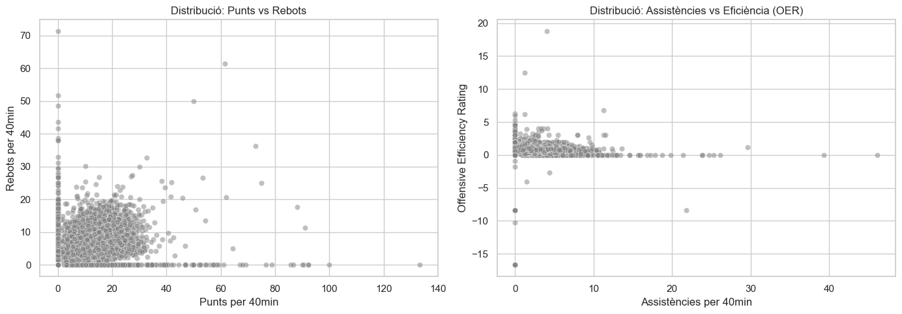
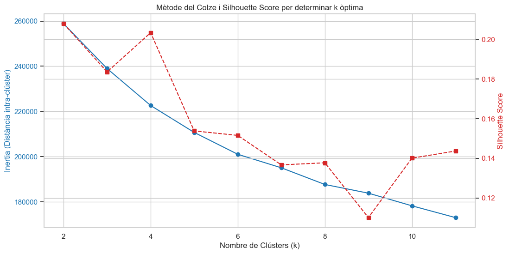
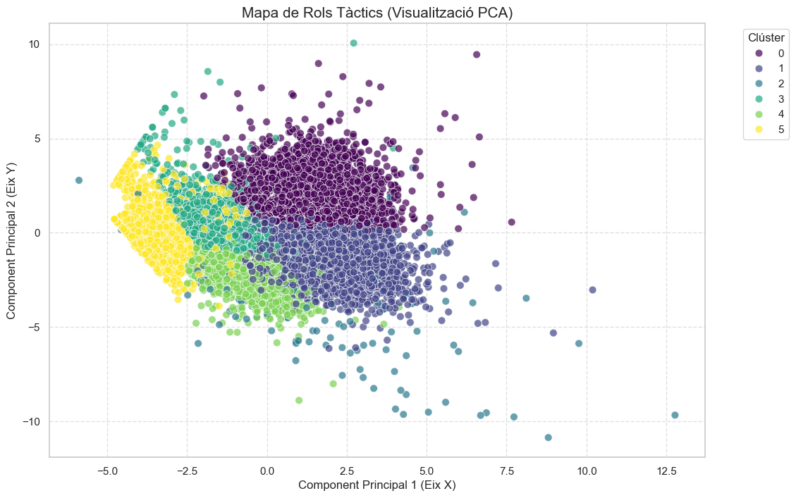
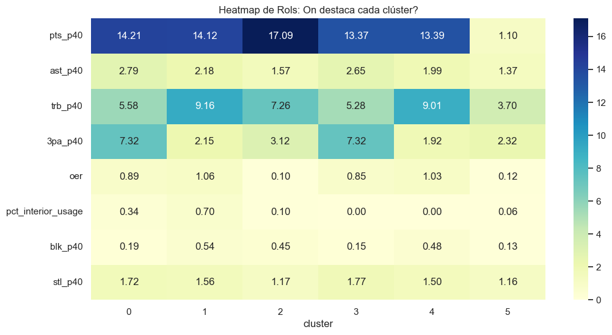
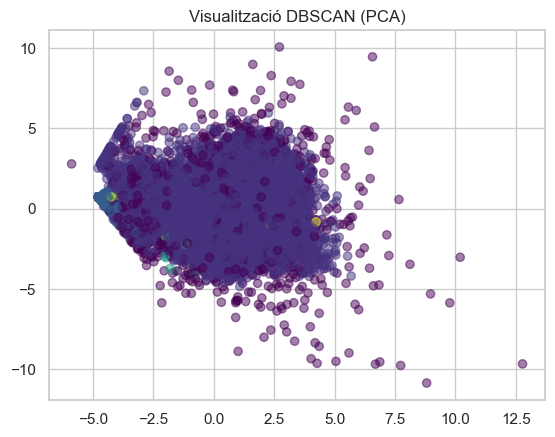

# Part 2: Model de machine learning (Clustering)

## 1. Introducció i Objectius

L'objectiu d'aquesta fase és aplicar tècniques d'aprenentatge no supervisat (**Clustering**) sobre el dataset `Gold`. En lloc de dependre de les posicions clàssiques (1-5), busquem descobrir **rols tàctics reals** basats en el comportament estadístic.

L'anàlisi se centra en identificar perfils de jugadors que comparteixen estils de joc similars, permetent una comprensió més profunda de l'estructura de les lligues FEB.

## 2. Preprocessament de les dades
El model **K-Means** es basa en distàncies euclidianes, la qual cosa fa que el preprocessament sigui el pas més crític per obtenir resultats coherents.

### 2.1. Selecció de "Features"
Hem seleccionat 24 variables que defineixen l'estil i l'eficiència, descartant dades identificatives o de volum absolut. Les dimensions inclouen:
* **Eficiència:** OER, DER Proxy, TS%.
* **Estil de Tir:** Usage 2P/3P, FTR, Percentatges de distribució espacial.
* **Eficàcia per Zona:** Paint, Mid-range, Corner 3, Above the break 3.
* **Rendiment P40:** Punts, Rebots (O/D), Assistències, Robatoris, Taps, Pèrdues i Faltes.

### 2.2. Estandardització
S'ha aplicat un **StandardScaler** per normalitzar les escales. Això garanteix que totes les variables tinguin una mitjana de 0 i una variància de 1, evitant que els Punts (escala 0-30) dominin sobre els Taps (escala 0-3).

### 2.3. Visualització Pre-Clustering (Justificació)
Abans d'aplicar l'algorisme, hem observat la distribució de les dades en brut. Com es veu a les gràfiques següents, les dades formen un "núvol" continu on no és obvi on acaba un tipus de jugador i on comença l'altre.

## 3. Determinació del Nombre de Clústers (k)
Per trobar el nombre òptim de rols ($k$), hem combinat dues mètriques:

1.  **Mètode del Colze (Inertia):** Observem on la reducció de la variància intra-clúster es comença a suavitzar.
2.  **Silhouette Score:** Mesurem la cohesió i separació dels grups.

### 3.1. Decisió Final: k=6
S'ha seleccionat **k=6** com el nombre òptim de clústers per les següents raons:
1. **Matemàtica:** És el punt on afegir més grups ja no aporta una reducció dràstica de l'error.
2. **Esportiva:** En el bàsquet professional, 6 grups permeten capturar les 5 posicions clàssiques més un perfil d'especialista (com el tirador de cantonada o el jugador purament defensiu), proporcionant un anàlisi tàctic equilibrat.

## 4. Implementació del model final

Un cop determinada la $k=6$, procedim a l'entrenament final de l'algorisme.

### 4.1. Visualització dels resultats

Com que treballem en un espai de 24 dimensions, apliquem **PCA (Principal Component Analysis)** per reduir les dades a 2 components principals que expliquen la màxima variància possible. Això ens permet visualitzar com el model ha traçat les fronteres entre clústers.

## 5. Anàlisi i Interpretació dels Perfils Tàctics

Per dotar de sentit esportiu als grups matemàtics, analitzem els **centroides** (les mitjanes) de cada clúster mitjançant un mapa de calor. Aquesta matriu ens revela quines variables domina cada grup.

### 5.1. Definició dels Rols Identificats

D'acord amb les dades obtingudes, podem caracteritzar els 6 rols de la següent manera:

#### 5.1.1 Interpretació i Caracterització dels Rols

Un cop analitzades totes les variables del model, hem assignat un nom representatiu a cada clúster basat en el seu perfil estadístic dominant. Aquesta segmentació ens permet identificar 6 tipologies clares de jugadors a les lligues FEB:

| Clúster | Nom | Descripció Esportiva |
| :--- | :--- | :--- |
| **C_0** | **Tiradors purs** | És el grup que millor representa l'especialització exterior. Tot i que comparteix un alt volum de llançaments de tres amb altres grups, la seva eficàcia des de la cantonada (eff_corner3: 0.31) el defineix com el perfil clàssic de tirador que castiga les ajudes defensives des de l'espai més eficient de la pista. |
| **C_1** | **Pivots oberts amb tir exterior** | En el context d'un pivot, un 18% d'ús del triple és una xifra molt significativa. No és un tirador pur (que estaria per sobre del 0.40 o 0.50), però és algú que "amenaça" des de fora. Un pivot interior clàssic tindria un valor proper a 0 o 0.05. |
| **C_2** | **Anotador tot terreny** | Seria el clàssic escorta o aler "penetrador" que força molts tirs lliures perquè no el poden aturar si no és amb falta. |
| **C_3** | **Guards/bases generador de joc** | El perfil de "Combo Guard". Assumeixen un gran volum de tirs (`fga_p40`) i són els principals assistents de la lliga. |
| **C_4** | **Pivots defensius** | Perfil clàssic de pintura. Líders en taps i rebots amb nul·la presència al perímetre. |
| **C_5** | **Jugadors de rotació i banqueta** | Perfils amb un impacte estadístic mínim (mitjana d'1 punt i 30 minuts totals per temporada). Són jugadors de rol per a moments molt puntuals. |

## 6. Comparació amb el model DBSCAN

Tot i que **K-Means** ha demostrat ser eficaç per segmentar la lliga en rols operatius, s'ha realitzat una prova comparativa amb l'algorisme **DBSCAN** (*Density-Based Spatial Clustering of Applications with Noise*).

### 6.1. Resultats del DBSCAN

A diferència del K-Means, el DBSCAN no requereix definir una $k$, sinó que busca zones d'alta densitat de dades. En aplicar-lo al dataset `Gold`:
* **Agrupament massiu:** El model ha tendit a agrupar la gran majoria de jugadors en un sol "clúster gegant".
* **Soroll (Outliers):** Ha identificat molts jugadors com a "soroll" (punts aïllats) en lloc de classificar-los en un rol.

### 6.2. Conclusió de la comparativa

S'ha decidit mantenir **K-Means** com el model principal per les següents raons:
1.  **Continu estadístic:** En el bàsquet, el talent i els rols són un "continu". No hi ha separacions físiques (buits de densitat) clares entre un pivot obert i un de defensiu; les seves estadístiques sovint se solapen.
2.  **Objectiu de negoci/esportiu:** El DBSCAN és excel·lent per detectar anomalies (outliers), però per a l'anàlisi tàctica d'una lliga, necessitem que cada jugador tingui un rol assignat, cosa que el K-Means garanteix mitjançant els centroides.
