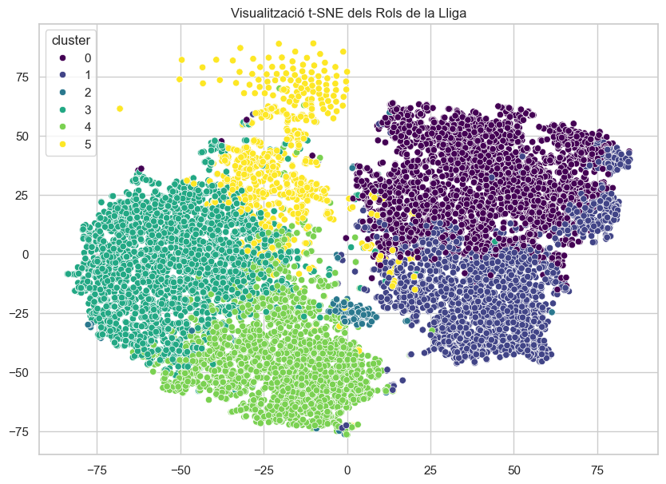
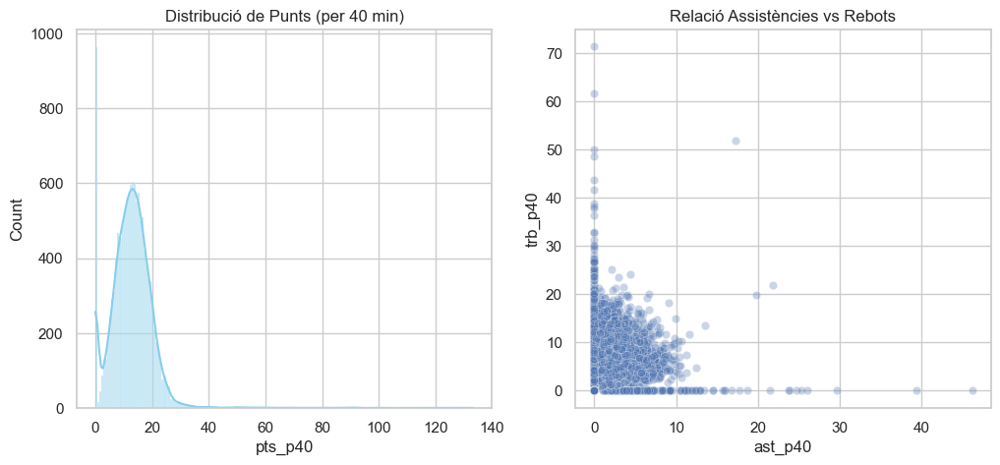
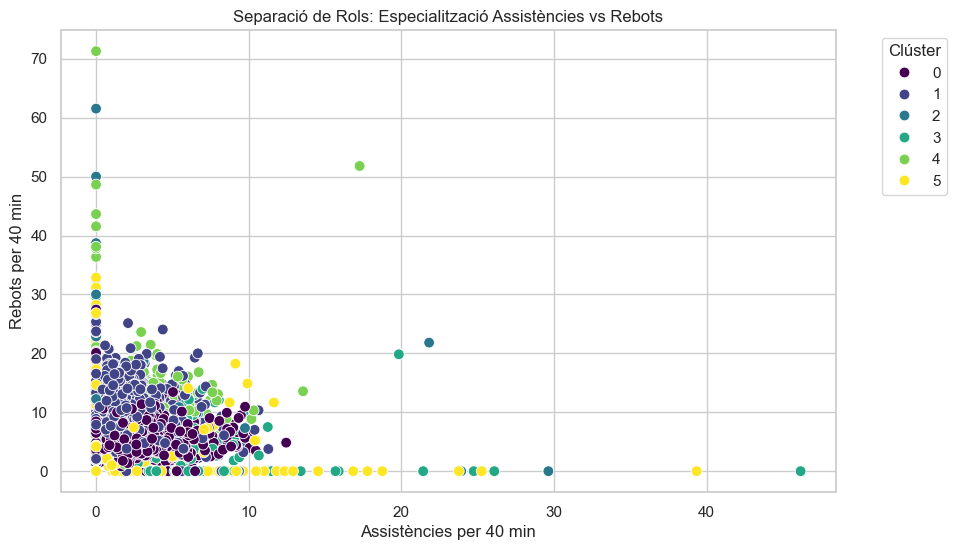
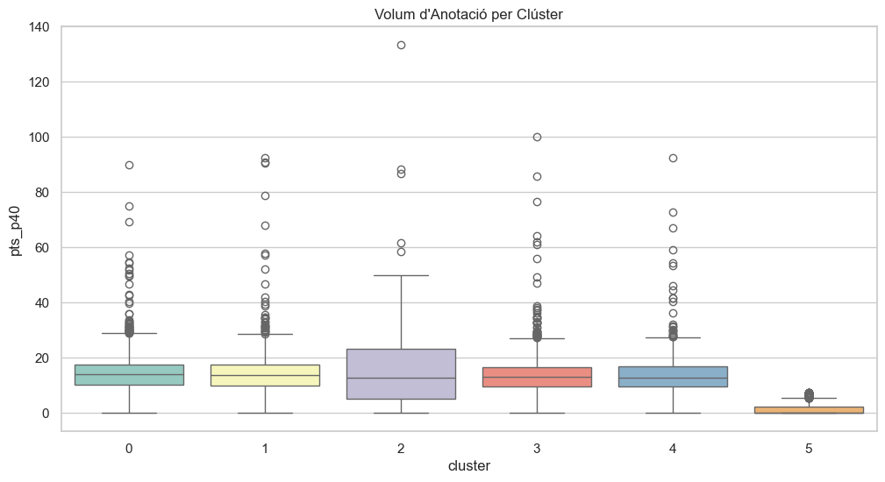

# Part 3: Visualització Avançada i Conclusions

## 1. Exploració Visual de l'Estructura de la Lliga
En aquesta fase final, utilitzem tècniques de reducció de dimensionalitat més avançades per confirmar que la divisió en 6 clústers és robusta.

### 1.1. Visualització t-SNE

#### 1.1.1. Ànàlisi dels Resultats

L'algorisme **t-SNE** (*t-Distributed Stochastic Neighbor Embedding*) ens ofereix una visió molt més detallada que el PCA, ja que prioritza mantenir els "veïns propers" junts. L'anàlisi de la gràfica revela tres punts clau:

1. **Illes de Talent i Especialització:** S'observen agrupacions molt nítides i separades (illes) per als perfils més extrems. Per exemple, els **Tiradors purs (C0)** i els **Pivots defensius (C4)** formen clústers molt compactes als extrems de la visualització. Això confirma que el model ha detectat signatures estadístiques molt úniques que no es barregen amb la resta de la lliga.

2. **El "Nucli de Rotació" (C5):** El clúster de jugadors amb baixa participació apareix com una massa molt densa i centralitzada. Des d'un punt de vista de gestió de dades, això és un èxit: el model ha estat capaç d'identificar que, independentment de la seva posició teòrica, els jugadors amb pocs minuts es comporten de manera gairebé idèntica a nivell de dades.

3. **Zones de Transició i Rols Híbrids:** A diferència de les illes aïllades, els **Guards/bases (C3)** i els **Anotadors tot terreny (C2)** mostren una certa proximitat o "ponts" entre els seus punts. Com a entrenador, això té tot el sentit del món: reflecteix el bàsquet modern on la línia entre un base que anota i un escorta que genera joc és cada cop més difusa. El t-SNE és capaç de capturar aquesta continuïtat que el K-Means ha segmentat per necessitat operativa.

**Conclusió visual:** El fet que els clústers del K-Means apareguin com a taques de color homogènies i no barrejades en el mapa t-SNE, valida que el nombre de clústers ($k=6$) és l'òptim per capturar l'estructura real de la competició.

### 1.2. Comparativa: De les Dades en Brut als Resultats del Model

Per entendre el valor del model de Machine Learning, és necessari comparar l'estat inicial de les dades amb la segmentació final obtinguda.

#### 1.2.1. Les Dades de Partida: Un "Núvol" Indiferenciat

Abans del clustering, les dades de la FEB es presenten com un continu on és difícil traçar línies divisòries. Com s'observa a la imatge, si mirem la relació entre assistències i rebots, la majoria de jugadors s'acumulen en una zona central, barrejant posicions i estils de joc.

#### 1.2.2. Els Resultats: Especialització i Rols Tàctics
Després d'aplicar el K-Means, el model és capaç d'"endreçar" aquest caos. A la imatge, veiem com els mateixos jugadors ara estan clarament agrupats:
* Els **Guards/bases (C3)** es desplacen cap a la dreta (més assistències).
* Els **Pivots defensius (C4)** i **Pivots oberts (C1)** es desplacen cap amunt (més rebots).
* Els **Anotadors (C2)** i **Tiradors (C0)** es mantenen en zones d'alt volum però amb ràtios d'assistència/rebot equilibrats segons la seva funció.

#### 1.2.3. Perfil d'Anotació: Boxplot per Clúster
Un dels indicadors més clars de l'èxit del model és la distribució de punts. Com s'observa al gràfic de caixes, cada clúster té un "rang" d'anotació molt definit. El **C2 (Anotadors)** presenta la mediana més alta, mentre que el **C5 (Rotació)** queda clarament aïllat a la part baixa, confirmant que el model ha detectat correctament el pes ofensiu de cada jugador.

### 1.3. Anàlisi Espacial: Validació dels Rols mitjançant Heatmaps

Per confirmar que els clústers identifiquen estils de joc i no només xifres buides, hem creuat el model de ML amb el dataset de més d'1 milió de tirs (`players_shots`). L'objectiu és veure on s'executen les accions de cada grup.

